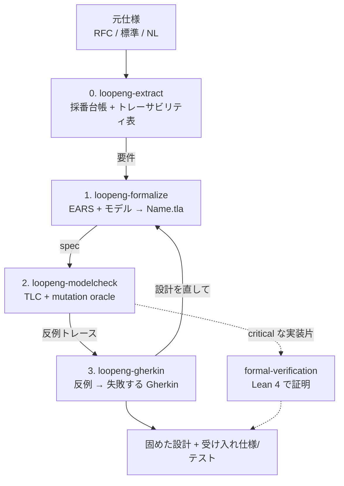

# Loop Engineering (NL → EARS → TLA+ → Gherkin)

自然言語の要求を 3 つのフィードバックループで段階的に厳密化する。
各ループは検証器を検証対象より上位層に置く。LLM が要求を構造化し、TLC が網羅探索で厳密に検査するハイブリッド。
生成物(spec / feature)は手編集せずソースから再生成する。

設計の正しさは **TLA+**(このループ)、実装そのものの数学的証明は **formal-verification(Lean 4)**。役割が違う。無理に結線しない(YAGNI)。

## 使うとき / 使わないとき

判断軸は1つ。**遷移の途中状態・順序・並行があるか。** あれば人手のテストで網羅しきれない状態空間があり、TLA+ の網羅探索が効く。無ければ過剰。

| | 使う(動的=状態遷移・順序・並行がある) | 使わない(静的=1回決めれば終わり) |
| --- | --- | --- |
| 一般 | 複数アクターの interleaving、ロック/キュー/リトライ、接続のライフサイクル、分割入力の結合・順序保証 | 通常の CRUD・UI・ビジネスロジック、逐次処理 |
| IaC | create/update/replace/destroy ライフサイクルと置換順序、依存グラフと apply 順序、並行 apply / state lock、apply 失敗からのロールバック整合・冪等性・drift 収束、Step Functions / blue-green / フェイルオーバ | 単発リソース宣言、命名規約、タグ/必須フィールド、ポリシーの静的妥当性 |
| 逃がし先 | — | 通常の TDD / property-based testing。IaC は `terraform validate`・tflint・OPA/Conftest・`terrashark` スキル |

IaC は厳密であってほしいので**動的側面は積極的に**このループで固める。だが静的な宣言検査に TLA+ を持ち込むのは過剰。**「使わない」が多数派**だと自覚する。

## 着手前の判断(必ず最初に1回)

**既定は「使わない」。** 下の2問を**両方** yes で通って初めて起動する。片方でも no なら通常のテストへ逃がし、迷いは no 寄りに倒す。

1. **遷移の途中状態・順序・並行が本当にあるか?** 表の左列に具体的に当たるか。「将来そうなるかも」は no。
2. **状態空間を小さく有限化できるか?** ここで落ちる方が多い。**カウンタ・無制限コレクション・自由文字列・時刻/タイムスタンプ・無制限リトライ回数が状態に入るなら、まず即 property-based testing に逃がす。** TLA+ を続けるのは、それらを `CONSTANT` の小さい値域(例: 最大3接続・キュー長2)に抽象化しても検証したい性質が保たれると言い切れるときだけ。「絞れそう」では起動しない。

両方 yes を通った要件だけ工程へ進む。導入・学習コストは判断材料に入れない。**判断材料はあくまで上の2問。**

## 工程(各フェーズは専用スキルへ委譲)

| 順 | スキル | やること | 出口条件 |
| --- | --- | --- | --- |
| 0 | **loopeng-extract** | 元仕様から要件を採番チェックリスト台帳へ網羅抽出、トレーサビリティ表を立てる | 全 `S-ID` が `[x]`・欠番なし |
| 1 | **loopeng-formalize** | EARS + 状態/ドメインモデル → `<Name>.tla`/`.cfg` | 全 EARS 行が spec の disjunct/Inv に対応 |
| 2 | **loopeng-modelcheck** | TLC で全到達状態を検査 + spec 自体を mutation testing | `No error` かつ真の survivor 0 |
| 3 | **loopeng-gherkin** | 反例 → Gherkin 機械変換、正常系シナリオ追加 | 反例が尽き「テスト」列が埋まる |

外 → 中 → 内 → 直して外へ、を反例と survivor が尽きるまで回す。前段の出口条件を満たさず次へ進まない(各スキルが前提として検査する)。

**本題に広げる前に、最小例で3ループ通すことを必ず確認する。** 初回は [`references/example-counter.md`](references/example-counter.md)(Counter の 0段→3ループ完全例)をなぞってから本題の spec を書く。

## 前提ツールと成果物の置き場

- 駆動装置(tlc / loop-* / 0段ゲート hook): [`../_shared/loopeng-toolchain.md`](../_shared/loopeng-toolchain.md)。未導入なら導入を促し、勝手に大規模インストールしない。
- 生成物はすべて `tasks/loopeng/` 配下・git 管理外。管理番号・手法用語を本体に漏らさない: [`../_shared/stealth-artifacts.md`](../_shared/stealth-artifacts.md)。
- 実装への橋渡し(Lean / test-design との分担、結線チェック): [`references/bridging.md`](references/bridging.md)。
- 抽出/検査を subagent へ並列委譲するとき: [`../_shared/parallel-delegation.md`](../_shared/parallel-delegation.md)。
- コード/テスト/コミット/コメントの役割分担: [`../_shared/code-comment-commit-roles.md`](../_shared/code-comment-commit-roles.md)。

## 完了前の必須ゲート(コンプライアンスレビュー)

完了扱いにする前、または「設計を検証した/網羅した」と報告する前に、必ず `hymme:loop-engineering-reviewer` サブエージェントへ渡して外側から検査させる。
渡すもの: 0段の抽出台帳とトレーサビリティ表のパス、本体ソースの場所。
レビュアーが挙げた違反(採番チェックリストの未完、台帳の欠落、`.tla`/`.feature` の手編集乖離、本体への管理番号・手法用語の漏れ)を解消してから完了とする。自分で「守れている」と判断して飛ばさない。

**実行ゲートで追加確認する2点**(実地教訓: [`../loopeng-extract/references/lessons.md`](../loopeng-extract/references/lessons.md)):

- **検証環境が本番と同じ条件か**: 容量・タイムアウト等の環境依存パラメータをテストと本番で別の値にしない。可能なら本番の定数をテストと共有し、値を2箇所に書かない。
- **緑判定がパイプに exit code を飲まれていないか**: 検証ゲートは失敗しうるコマンドを単体で実行し、その exit code を直接確認する(`set -o pipefail` でも可)。

## やらないこと

- 0段の抽出台帳を省いて EARS / TLA+ へ進まない(PreToolUse hook が機械的に強制する)。
- 生成物(`.tla`/`.feature`)を手編集して源泉と乖離させない。源泉を直して再生成する。
- 通常のユニットテストで足りる小タスクにループを持ち込まない。状態遷移・並行・プロトコルが無いなら過剰。
- 管理番号・手法用語を本体へ漏らさない([`../_shared/stealth-artifacts.md`](../_shared/stealth-artifacts.md))。
- 小さく始める。Counter 例が3ループ通ってから本題へ広げる。
