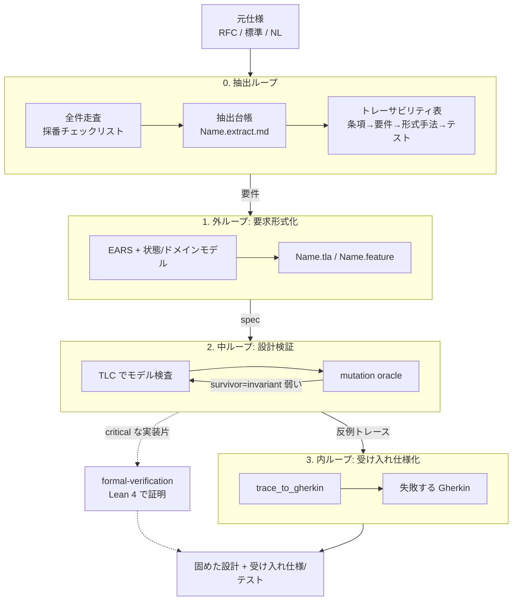

# Loop Engineering (NL → EARS → TLA+ → Gherkin)

自然言語の要求を 3 つのフィードバックループで段階的に厳密化する。
各ループは検証器を検証対象より上位層に置く。
LLM が要求を構造化し、TLC が網羅探索で厳密に検査するハイブリッド。
生成物(spec / feature)は手編集せずソースから再生成する。

設計の正しさは **TLA+**(このループ)、実装そのものの数学的証明は **formal-verification(Lean 4)**。
役割が違う。無理に結線しない(YAGNI)。

## 使うとき / 使わないとき

判断軸は1つ。**遷移の途中状態・順序・並行があるか。** あれば人手のテストで網羅しきれない状態空間があり、TLA+ の網羅探索が効く。無ければ過剰。

| | 使う(動的=状態遷移・順序・並行がある) | 使わない(静的=1回決めれば終わり) |
| --- | --- | --- |
| 一般 | 複数アクターの interleaving、ロック/キュー/リトライ、接続のライフサイクル、分割入力の結合・順序保証 | 通常の CRUD・UI・ビジネスロジック、逐次処理 |
| IaC | create/update/replace/destroy ライフサイクルと置換順序、依存グラフと apply 順序、並行 apply / state lock、apply 失敗からのロールバック整合・冪等性・drift 収束、Step Functions / blue-green / フェイルオーバ | 単発リソース宣言、命名規約、タグ/必須フィールド、ポリシーの静的妥当性 |
| 逃がし先 | — | 通常の TDD / property-based testing。IaC は `terraform validate`・tflint・OPA/Conftest・`terrashark` スキル |

IaC は厳密であってほしいので**動的側面は積極的に**このループで固める(0段では IaC コード/モジュール仕様を元仕様に、遷移・順序・並行・失敗時不変条件を要件へ抽出)。だが静的な宣言検査に TLA+ を持ち込むのは過剰。**「使わない」が多数派**だと自覚する。

## 着手前の判断(必ず最初に1回)

**既定は「使わない」。** このループが要るのは開発タスクのごく一部。下の2問を**両方** yes で通って初めて起動する。片方でも no なら通常のテストへ逃がし、迷いは no 寄りに倒す。

1. **遷移の途中状態・順序・並行が本当にあるか?** 表の左列(複数アクターの interleaving、ロック/キュー/リトライ、接続ライフサイクル、分割入力の結合・順序)に具体的に当たるか。「将来そうなるかも」は no。
2. **状態空間を小さく有限化できるか?** ここで落ちる方が多い。**カウンタ・無制限コレクション・自由文字列・時刻/タイムスタンプ・無制限リトライ回数が状態に入るなら、まず即 property-based testing に逃がす。** TLA+ を続けるのは、それらを `CONSTANT` の小さい値域(例: 最大3接続・キュー長2)に抽象化しても検証したい性質が保たれると言い切れるときだけ。「絞れそう」では起動しない。

両方 yes を通った要件だけ 0段へ進む。導入・学習コストは判断材料に入れない(裏方で回し台帳/spec はリポジトリに残さない。「成果物の置き場」参照)。**判断材料はあくまで上の2問。**



## 詳細リファレンス(必要時に読む)

本体は流れだけ。具体手順・罠・実例は分けてある。詰まったら読む。

- [`references/troubleshooting.md`](references/troubleshooting.md) — 実行時の罠(TMPDIR/JDK 即死、TLC スクラッチ、トレース形式)。動かないときまずここ。
- [`references/mutation-oracle.md`](references/mutation-oracle.md) — equivalent-mutant の見分けと打ち切り基準。survivor を潰すとき。
- [`references/gherkin-runners.md`](references/gherkin-runners.md) — 生成 `.feature` を実行可能テストにする(言語別 OSS、C 例外)。
- [`references/lessons.md`](references/lessons.md) — 抽出漏れの実地教訓(ドメイン非依存)。0段の重要性の裏付け。
- [`references/example-counter.md`](references/example-counter.md) — Counter を 0段→3ループ通した最小完全例。初回はこれをなぞる。
- [`../_shared/parallel-delegation.md`](../_shared/parallel-delegation.md) — 抽出/検査を複数 subagent に並列で投げるときの落とし穴(共有リソースの直列化・命名衝突の予防・単体緑≠統合緑・成果物の実在で進捗判定・外部ツールの sandbox 可否)。
- [`../_shared/code-comment-commit-roles.md`](../_shared/code-comment-commit-roles.md) — コード/テスト/コミット/コメントのどこに何を書くか(How/What/Why/Why not)。管理番号を本体に漏らさない規範の根拠。

## 前提ツール

- `tlc` / `sany`：TLA+ のモデル検査器とパーサ。`apalache-mc`：型チェック + 記号モデル検査(無限状態向け)。
  flake の `tools` に含む(`./env.sh install` 済みなら入っている)。
- `loop-outer` / `loop-middle` / `loop-inner`：`../../loopeng/Makefile.loopeng` 経由のループ駆動(fish 関数、または
  `make -f <このプラグインの loopeng ディレクトリ>/Makefile.loopeng loop-outer SPEC=<Name>` を直接叩いてもよい)。
  Makefile 本体・Python オラクル(`trace_to_gherkin.py`/`tla_mutate_oracle.py`等)・テンプレートはこのプラグインの
  `loopeng/` 配下に同梱されている。fish 関数を使う場合は `LOOPENG_HOME` をこのプラグインの `loopeng/` へ向ける。
- 0段ゲート(`hooks/loopeng-extract-gate.sh`)はこのプラグインの `hooks/hooks.json` で PreToolUse として配布される。
  プラグインを有効化していれば追加設定なしで効く。

未導入なら導入を促し、勝手に大規模インストールしない。

「裏方」(成果物の置き場)と矛盾しない: **裏方なのは生成物**(台帳・spec・feature= `tasks/loopeng/` 配下、git 外)。ここのツール(tlc/hook/Makefile)は**それを回す環境側**で、検証対象リポジトリの git 管理物ではない。環境に駆動装置があることと、リポジトリに痕跡を残さないことは別レイヤ。

## ワークフロー

順に進む。各ループで止まって検証する。`SPEC=<Name>` を通して呼ぶ。

### 0. 抽出ループ: 元仕様 → 要件への網羅的抽出

**EARS を書く前に、元仕様(RFC、標準、自然言語仕様)から要件を漏れなく抜き出す工程を必ず置く。**
外ループ以降は「与えられた要件」を厳密に検証するが、**抽出そのものの網羅は守らない**。
漏れは各層の内側ではなく、この入口に落ちる(実例は [`references/lessons.md`](references/lessons.md))。

原則は **過剰抽出は安全、漏れは危険**。
採り過ぎは後で「背景」に落とせるが、採り損ねた要件は下流のどの層にも現れず出口でしか露見しない。
迷ったら採る。

**既存コードから要件を逆抽出するときの罠**: 現状の挙動をそのまま「正解」として写し取らない。コードのバグごと仕様化すると、抽出仕様も TLA+ モデルも同じバグを共有し、TLC が緑でもバグは残る。台帳では「現状コードはこう動く」と「本来の仕様として正しいか(要人間確認)」を別列に分け、後者を必ずレビュー対象にする。

#### 入口: 仕様を全件走査して要件候補を出し切る

仕様の構造単位(走査アンカー)を選ぶ。文書の型で変わる。
**「規範語 grep」は数あるアンカーの一つで、RFC 形式にしか効かない。**

- **規範語のある文書(RFC 等)**: RFC 2119 の11語を grep で全件。大文字のみが規範(RFC 8174、`-i` なし)/否定形を最長一致で前置/word boundary。例 `grep -nE '\b(MUST NOT|SHALL NOT|MUST|SHALL|SHOULD|MAY)\b' spec.txt`。
- **日本語の仕様書/PRD/規程**: 規範表現「〜しなければならない/してはならない/する必要がある/することができる/必須/任意/推奨」。法令調なら条・項・号が単位。
- **構造化仕様(OpenAPI/protobuf/JSON Schema/状態遷移表)**: 機械可読なので**全要素を列挙**。エンドポイント×メソッド、各フィールド制約、表の全セル。grep でなくパーサで。
- **ユーザーストーリー/チケット/PRD 散文**: 各受け入れ条件・各箇条書きを単位に。規範語が無いので各文を候補列挙し「要件か/背景か」分類(LLM ドラフト→人レビュー)。

抽出後に「この単位を1つ残らず拾ったか」を仕様の目次/章立てと突き合わせる。

#### 採番チェックリスト方式(毎ループの必須ゲート)

> **STOP**: この台帳を完成させるまで外ループ(EARS/TLA+)へ進むな。[`assets/extract-template.md`](assets/extract-template.md) を `tasks/loopeng/<Name>.extract.md` にコピーして埋めることから始める。`loop-outer`/`loop-middle`/`loop-inner` は PreToolUse hook([`hooks/loopeng-extract-gate.sh`](../../hooks/loopeng-extract-gate.sh))が台帳を検査し、台帳なし・`[ ]` 残り・`S-NNN` 欠番のいずれかで**機械的にブロック**する。頭の中抽出・後埋めは hook で弾かれる。

頭の中でやると漏れる。**消し込み可能なワークシート**に落とす。1ファイルで完結させる。

1. [`assets/extract-template.md`](assets/extract-template.md) を `tasks/loopeng/<Name>.extract.md` にコピーし、元仕様を「## 台帳」へ写す(原文保全、行番号/条項を引くため)。
2. 走査アンカーごとに1行立て、**一意 ID を連番で振る**(`S-001`...)。grep 規範文・各フィールド・各受け入れ条件が1行=1 ID。
3. 各行を **チェックボックス付き Markdown** にし、出典と原文抜粋を併記。
4. 各 ID を **EARS の1文へ変換**して同じ行に書き、変換し終えたら `[x]`。1 ID が複数 EARS に割れてよい。
5. **未チェック残り = 抽出途中**。全 ID が `[x]`・連番に欠番なしで入口を閉じる。この ID(`S-xxx`)がトレーサビリティ表の「仕様条項」列になる。

```
## 抽出台帳(tasks/loopeng/<Name>.extract.md)
- [x] S-001 RFC§7.4.1 「endpoint MUST send a Close frame ...」
      → WHEN closing the connection the system SHALL send a Close frame. (event)
- [ ] S-002 RFC§5.2 「RSV1, RSV2, RSV3 MUST be 0 ...」   ← 未変換=漏れ予備軍
```

台帳を省いて頭の中で抽出する、既存 EARS から逆に後埋めする、は禁止。台帳が無い/未完なら設計検証は未着手。
口頭の要求だけで原文が無いときも、その要求文を `tasks/loopeng/` に書き起こして起点にする。

#### 工程: トレーサビリティ・マトリクス(漏れの本命対策)

各 ID を **「仕様条項ID → 要件(EARS R番号) → 形式手法(TLA+ INV / Lean P番号) → テスト」を1行で対応づける表**にする。
漏れが「空欄」という見える形になる。

```
| 仕様条項        | 要件(EARS) | 形式手法 | テスト          |
|-----------------|------------|----------|-----------------|
| RFC§7.4.1 close | R-xx       | Lean P7  | test_close_code |
| RFC§5.2 RSV     | (空欄!)    | -        | -               | ← 抽出漏れが見える
```

- 軽量なら Markdown 表で十分。CI ゲート化は **OpenFastTrace**(被覆未達で非ゼロ終了)か **Doorstop**(`uv pip install doorstop`)。
- 「形式手法は埋まるのに要件列が空」= 証明済みなのに駆動する要件が無い(実装に結線されない)非対称も一目で出る。

このマトリクスは0段だけでなく**全ループ共通の消し込み台帳**として使い回す(後述)。

#### 抽出の網羅を底上げする2手(任意だが効く)

- **unwanted の系統生成**: 各 event 要件(正常系)に「この入力が不正なら?」を必ず問い、unwanted(IF-THEN)を立てる。
- **多視点の独立抽出 + 突き合わせ**: 違う観点(状態機械/バイト/セキュリティ/相互運用)で独立抽出し union を取る。`adaptive-explore` workflow や複数 subagent で観点を分ける。**同じ観点を N 回より違う観点を1回ずつ**。

#### 出口: 独立基準で漏れを逆検出(最後の砦)

抽出の完全性は証明できないので、実装の振る舞いを**抽出系と独立な基準**でテストして漏れを逆算する。

- **ファジング**: 不正/境界入力で落ちる・誤受理する=unwanted 漏れ。ドメイン非依存の第一手。
- **差分テスト**: 信頼できるリファレンス実装と出力差=どちらかの要件漏れ。
- **性質ベーステスト**: 抽出した不変条件を生成入力で叩く。
- **既製の適合性スイート(あるドメインだけ)**: WebSocket→Autobahn 等。**大半のドメインに既製品は無い**ので無いのが普通と構える。

### 1. 外ループ: NL を EARS + 状態/ドメインモデルへ

抽出した要件(または最初から自然言語の要求)を2つに構造化する。曖昧な点はモデル化前にユーザーへ確認。

- **EARS 記法**で各要求を1文ずつ。型を取り違えない:
  - ubiquitous: 「The <system> SHALL <response>.」(常時の義務)
  - event: 「WHEN <trigger> the <system> SHALL <response>.」
  - state: 「WHILE <state> the <system> SHALL <response>.」
  - unwanted: 「IF <condition> THEN the <system> SHALL <response>.」(異常系)
  - optional: 「WHERE <feature> the <system> SHALL <response>.」
- **状態/ドメインモデル**: 名詞=状態変数、各変数の型(値域)、初期状態、不変条件。各 EARS 節がどの状態遷移に対応するかを対応づける。

**モデル化で捨てた領域を明示する(抽象化の死角対策)**: 状態機械に不要な詳細(値の内部表現、エンコーディング形式、
個々のフィールドの妥当性)を捨てるのは正しい設計判断だが、**捨てた領域は TLC の検査範囲に原理的に入らない**。
モデル化の際、「この変数・このフィールドは状態機械の外側で別途検証する」と決めた箇所を0段の台帳に
一言残す(トレーサビリティ・マトリクスの備考、または台帳の該当行)。書き残さないと、その領域は
どの層でも検証されないまま消える([`references/lessons.md`](references/lessons.md) の抽象化の死角)。

`loop-outer SPEC=<Name>` でテンプレから `<Name>.tla`/`<Name>.feature` を scaffold(既存は壊さない)。EARS とモデルから埋める。

- `VARIABLES` = 状態変数。`TypeOK` = 各変数の型(値域)を `\in` で(網羅性のアンカー)。`Init` = 初期状態。
- `Next` = **EARS の各 event/state/unwanted 節を 1 disjunct** に。`\/ Action1 \/ Action2 ...`。1節1アクション。
- `Inv` = ubiquitous /「SHALL never」を安全性に。応答義務・到達性が要るなら `<>`/`[]` で別途。

`<Name>.cfg` に `INIT`/`NEXT`/`INVARIANT`(必要なら `CONSTANT` で状態空間を絞る)。

### 2. 中ループ: TLA+ で設計を検査し、検査の強さ自体を検証する

`loop-middle SPEC=<Name>` を回す。2段。

1. **model-check**: TLC が `Inv` を全到達状態で検査。`No error` なら設計は不変条件を守る。反例が出たら穴 → 内ループへ。
2. **mutation oracle**: spec に機械的ミューテーションを注入し、TLC が検出(killed)するか確認する。

**survivor が出たら spec が弱い。** 「kills every mutant」相当になるまで回す。これが「検証器を検証する」上位ループ。

> survivor の大半は **equivalent-mutant**(kill 不能)。見分け方・判定手順・打ち切り基準は [`references/mutation-oracle.md`](references/mutation-oracle.md)。「真の安全性 survivor が 0」で打ち切ってよい。

### 3. 内ループ: TLC の反例を Gherkin の受け入れ仕様へ

`Inv` を破る反例は、設計レベルのバグであり**実行可能な反例**でもある。
`loop-inner SPEC=<Name>` で TLC のエラートレースを `<Name>.feature` の Gherkin Scenario に変換(`trace_to_gherkin.py`)。

- 初期状態 = `Given`、各アクション = `When`、変化した変数 = `Then becomes ...`。
- この feature は「起きてはならない」失敗例。設計を直して反例が消えるまで外/中ループへ戻す。
- 設計が固まったら、正の受け入れシナリオ(EARS 正常系)を `.feature` に足し、実装の受け入れテストにする。

> 生成 `.feature` を実行可能テストにする配線(言語別 OSS ランナー、C の例外、緑/赤での生死実証)は [`references/gherkin-runners.md`](references/gherkin-runners.md)。

## 全ループ共通の消し込み台帳

0段で作るトレーサビリティ・マトリクス**1枚を全ループ共通の台帳として使い回す**(各ループで別台帳を増やさない)。
**マトリクスの各列が各ループの消し込み対象**。列が全行埋まったかで網羅を判定する。

- **外ループ(EARS → TLA+)**: 各 R番号が `Next` disjunct / `Inv` / temporal のどれかに対応するか。「形式手法」列が空の EARS 行=外ループの漏れ。
- **内ループ(正シナリオ追加)**: TLC 反例由来は機械変換で消し込み不要(1反例=1 feature)。手作業は正常系の受け入れシナリオで、「テスト」列が空の event/state 系 EARS 正常系=内ループの漏れ。
- **中ループ(TLC + mutation)は新規チェックリスト不要**(YAGNI)。TLC の全到達状態探索と survivor 列挙が機械的に担う。

## 3 ループの回し方

外(要求形式化)→ 中(設計検査 + 検査の強さ検証)→ 内(反例の受け入れ仕様化)→ 直して外へ、を反例と survivor が尽きるまで回す。
3 つは独立した検証層で、下の層の出力が上の層の入力になる。

**本題に広げる前に、最小例で3ループ通すことを必ず確認する。** 初回はまず下の Counter 骨格を1周し、それから本題の spec を書く。完全な手本(台帳・mutation・反例→Gherkin・本体への落とし方)は [`references/example-counter.md`](references/example-counter.md)。

```
# 0段: 台帳 (tasks/loopeng/Counter.extract.md)
- [x] S-001 「counter は 0..Max。inc で +1、Max を超えない」
      → WHILE n < Max WHEN inc the system SHALL increment n.  (state+event)
      → IF n = Max THEN the system SHALL NOT increment.        (unwanted)

# 外: Counter.tla — EARS 各節を 1 disjunct に
VARIABLES n
TypeOK == n \in 0..Max          \* 値域=網羅アンカー
Init   == n = 0
Inc    == n < Max /\ n' = n + 1 \* event/state 節
Next   == Inc \/ UNCHANGED n
Inv    == n <= Max              \* 「Max を超えない」= 安全性
# Counter.cfg: INIT Init / NEXT Next / INVARIANT Inv / CONSTANT Max = 3

# 中: loop-middle SPEC=Counter
#   model-check → No error なら設計OK
#   mutation → Inc を「n' = n + 2」に変異 → TLC が Inv 違反で killed なら oracle 緑

# 内: もし Inv が破れたら loop-inner が反例トレースを Counter.feature の
#   Given n=3 / When inc / Then n stays 3  へ機械変換。直って消えるまで外/中へ戻す
```

## 成果物の置き場(デフォルトは裏方)

ユーザーが明示しない限り、このループは**裏方**で回す。生成物をリポジトリの git 管理に持ち込まない。

- 作業場所は `tasks/loopeng/` 配下(`tasks/todo.md` と同じエリア)。**各ループの中間生成物すべて**(0段の抽出物、外ループの EARS/モデル、`.tla`/`.cfg`/`.feature`、トレーサビリティ表、TLC スクラッチ)をここで作る。`git add` の対象にしない。
- **git 管理下のドキュメントに設計検証の存在を書かない**。README・設計文書・コミット・PR に「TLA+ でモデル検査した」等を記載しない。表に出す成果は通常の実装とテストだけ。
- **管理番号・ループエンジニアリング由来の痕跡を本体に持ち込まない**。`S-001` 等の抽出 ID、`R-xx` の EARS 番号、TLA+ の `Inv`/disjunct 名、`P7` 等の Lean 番号を、本体ソースコードのコメント・docstring・変数名・テスト名・コミット・ドキュメントに書かない。`// S-012 を満たす`、`# traceability: R-3`、`test_S001_*` の類は禁止。これらは `tasks/loopeng/` の台帳の中だけで閉じる識別子で、本体からは存在を意識させない。
- 表に反映するのは**結果だけ**: 固めた設計を実装に落とし、TLC 反例由来の Gherkin は実装側のテストの述語へ移植する。テストのコメントにも「TLA+ 反例由来」「S-xxx 由来」と書かず、振る舞いそのものを説明する。本体は「このループ手法を一切知らない人が読んで完結する」状態に保つ。
- 例外(明示オプトイン時のみ): 「spec をリポジトリに入れて」「設計検証を文書化して」「管理番号をコードに残して」等とユーザーが言ったときだけ git 管理下へ置き、痕跡を残してよい。

## formal-verification(Lean)との橋渡し

設計が固まった後、**critical な実装片**(アルゴリズム・セキュリティ性質)は Lean で証明 → `formal-verification` skill / `prover` agent。
TLA+ で「設計が正しい」、Lean で「実装が設計通り」を分担。どちらの成果も Gherkin / property test に落とす。両者を機械的に変換しようとしない(YAGNI)。

反例由来の Gherkin や証明済み述語を、機能レベルのテスト群(正常系・境界・異常系)へ展開する段では `test-design` skill を使う。設計の網羅は TLA+ がやるので、`test-design` は残りの機能テストの手法選定(同値分割・境界値・property-based 等)を担う。

**証明済みでも実装が使っているとは限らない(結線チェック)**: Lean の証明は性質の正しさを保証するが、
**その証明対象の関数が実際の呼び出し経路から呼ばれているか**は証明系の関心事の外([`references/lessons.md`](references/lessons.md) の
証明と実装の非対称)。証明済み述語を実装へ橋渡ししたら、対応する関数が本番コードパスから呼ばれていることを
grep か呼び出しグラフで確認する。呼ばれていない証明はデッドコードで、緑のまま実効性が無い。

## 完了前の必須ゲート(コンプライアンスレビュー)

このスキルでの作業を完了扱いにする前、または成果を「設計を検証した／網羅した」と報告する前に、必ず `hymme:loop-engineering-reviewer` サブエージェントへ渡して外側から検査させる。
渡すもの: 0段の抽出台帳とトレーサビリティ表のパス、本体ソースの場所。
レビュアーが挙げた違反(採番チェックリストの未完、台帳の欠落、`.tla`/`.feature` の手編集乖離、本体への管理番号・手法用語の漏れ)を解消してから完了とする。自分で「守れている」と判断して飛ばさない。

**実行ゲートで追加確認する2点**(いずれも [`references/lessons.md`](references/lessons.md) の実地教訓):

- **検証環境が本番と同じ条件か**: 容量・タイムアウト等の環境依存パラメータをテストと本番で別の値にしていないか。
  テスト側だけ余裕を持たせた値を使うと、ユニットが全緑のまま本番だけ実際の入力サイズで壊れる。
  可能なら本番の定数をテストと共有し、値を2箇所に書かない。
- **緑判定がパイプに exit code を飲まれていないか**: `cmd | tail && 次` のように失敗しうるコマンドをパイプで
  繋いで判定すると、パイプ全体の終了コードは最後のコマンドのものになり、先頭コマンドの失敗が握りつぶされる。
  検証ゲートは失敗しうるコマンドを単体で実行し、その exit code を直接確認する(`set -o pipefail` でも可)。

## やらないこと

- **0段の抽出台帳を省いて EARS / TLA+ へ進まない。** 採番チェックリストが未完(`[ ]` 残り or 欠番)なら抽出は終わっていない。後埋めした体にしない。毎ループの必須ゲートで、`loop-*` 実行時に PreToolUse hook が機械的に強制する(意志に依存しない)。
- 生成物(`.tla`/`.feature`)を手編集して源泉(EARS + モデル)と乖離させない。源泉を直して再生成する。
- **真の survivor**(到達状態を変えるのに緑=設計の穴)を残したまま「設計検証済み」と言わない。一方 equivalent-mutant を 0 にしようと無限に粘らない([`references/mutation-oracle.md`](references/mutation-oracle.md))。
- 通常のユニットテストで足りる小タスクにループを持ち込まない。状態遷移・並行・プロトコルが無いなら過剰。
- **「巨大だから別タスク」と自分でスコープを縮めない。** 依存先の仕様(別 RFC・別標準)も調べて抽出対象に含める。大きいものは MECE に分割して順に積む。分割はスコープ除外ではない。完了条件は「指定範囲が全て `[x]` か、物理的に止まるまで」で、自発的な区切りを完了と偽らない(過剰抽出は安全・漏れは危険の出口側)。
- **管理番号(`S-001`/`R-xx`/`P7` 等)やループ手法の用語(EARS/TLA+/Gherkin/mutation)を本体ソース・コメント・テスト名・コミット・git 管理下ドキュメントに漏らさない**(明示オプトイン時を除く)。痕跡は `tasks/loopeng/` の中だけで閉じる。
- 小さく始める。1 spec の Counter 例が3ループ通ってから本題へ広げる。
